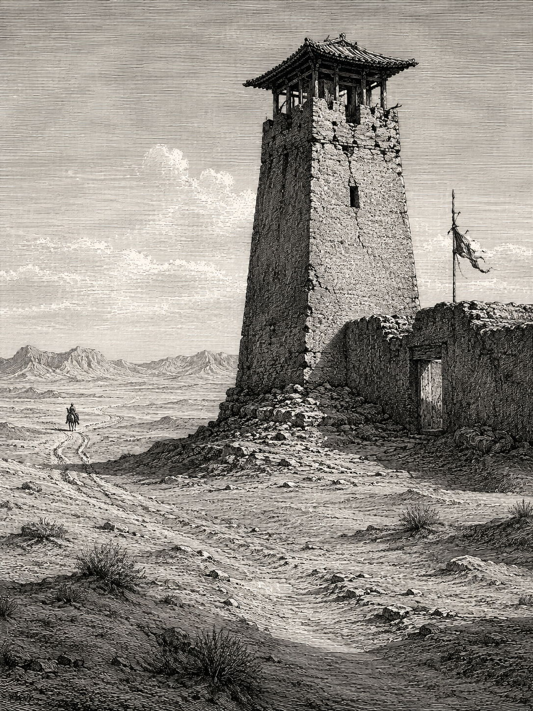
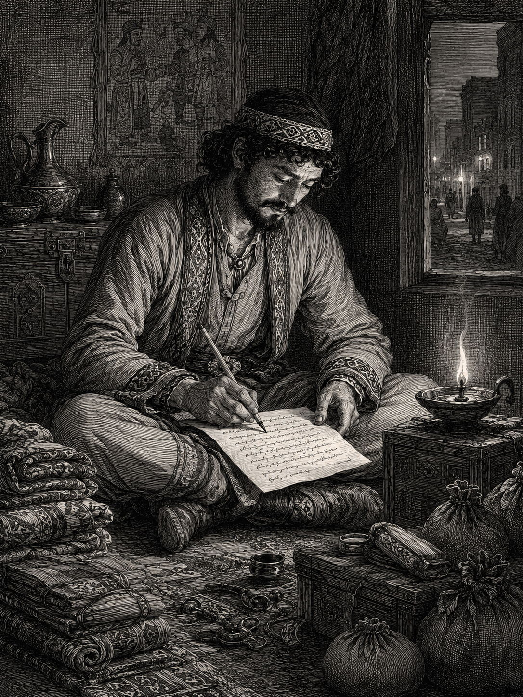
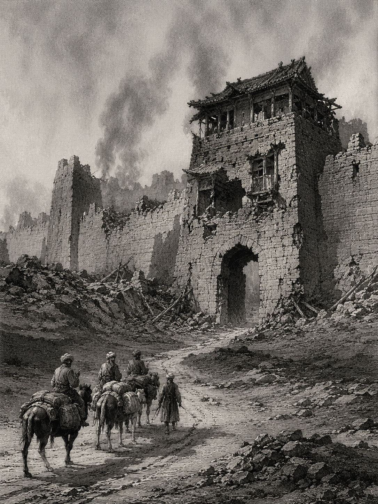

# Letter 2: Nanai-vandak to Varzakk

*A Sogdian merchant's report from the collapse of the Western Jin dynasty, ~313 AD*

---

*A frontier watchtower along the ancient Chinese defensive wall, near Dunhuang. In 1907, Aurel Stein found a leather mailbag sealed inside such a tower, containing letters that had waited seventeen centuries to be read.*

---

## The Writer and His World

Sometime around the year 313 AD, a Sogdian merchant named Nanai-vandak sat down to write a letter. He was far from home. His employer, a man named Varzakk of the Kanakk family, was in Samarkand, more than three thousand kilometers to the west across some of the most dangerous terrain in the ancient world. Nanai-vandak was likely writing from Jincheng, the modern city of Lanzhou, a garrison town in Gansu province at the gateway to the Hexi Corridor, the narrow passage between mountains and desert that connected China's interior to the Silk Road.

He was not writing with the luxury of calm. The Western Jin dynasty was collapsing around him. Xiongnu armies, once subjects of the emperor, had sacked the imperial capital Luoyang two years earlier, in 311 AD. Famine had preceded the armies. The emperor had fled. The palace had burned. The trade networks that Sogdian merchants like Nanai-vandak depended on were fracturing, and the communities of Sogdian traders scattered across Chinese cities were increasingly isolated, cut off from home, cut off from each other, and running out of options.

Nanai-vandak had not heard from colleagues deeper inside China in three years. He had sent agents eastward and received no reply. He had sent a man named Nasyan to Dunhuang, and Nasyan had died. The letter he was about to write would carry news of an empire falling apart, instructions about money left on deposit back home, and arrangements for the care of an orphan boy. It would end with directions for dividing thirty-two vesicles of musk into five shares.

The letter never reached Samarkand. It was found in 1907, sealed in the wall of a watchtower at the edge of the Taklamakan desert, where it had waited for sixteen hundred years.

---

*A Sogdian merchant composing a letter by oil lamp. The trade goods around him, cloth bundles and sacks, represent the commodities that sustained the Sogdian trading networks across Central and East Asia.*

---

## The Letter

The primary translation below is by Prof. Nicholas Sims-Williams, SOAS University of London (2004), hosted by the Silk Road Seattle Project, University of Washington. Where the independent translation by Vladimir A. Livšic (2009) diverges on points of substance, the differences are noted in the editorial annotations. Square brackets indicate uncertain or reconstructed readings in the original Sogdian text. Editorial notes in italics are added for context.

---

### The Envelope

> . . . should send and bring [this] letter to Samarkand. And [the noble lord Varzakk . . . should receive(?)] it all(?) [complete(?)]. Sent [by his] servant Nanai-vandak.

*Even the envelope tells a story. The word "servant" is a formal convention between a Sogdian agent and his patron, not a mark of literal servitude. Nanai-vandak was a trusted representative managing trade operations across thousands of kilometers.*

### The Address

> To the noble lord Varzakk (son of) Nanai-thvar (of the family) Kanakk. Sent [by] his servant Nanai-vandak.

### The Greeting

> To the noble lord Varzakk (son of) Nanai-thvar (of the family) Kanakk, 1,000 (and) 10,000 (times) blessing (and) homage on bended knee, as is offered to the gods, sent by his servant Nanai-vandak. And, sirs, (it would be) a good day for him who might see you happy (and) free from illness; and, sirs, (news of) your (good) health having been heard (by me), I consider myself immortal!

*The greeting formula, "I consider myself immortal," appears across multiple Sogdian letters. It was a standard expression, but reading it from a man surrounded by collapse, it carries a weight its authors may not have intended. Livšic (2009) translates the same phrase as "I would consider myself happy," noting that the literal Sogdian means "immortal." The difference is not trivial: one reading is a conventional wish, the other an invocation. Both translators are working from the same word.*

### News of the Sogdian Communities

> And, sirs, Armat-sach in Jiuquan (is) safe (and) well and Arsach in Guzang (is) safe (and) well. And, sirs, it is three years since a Sogdian came from "inside" [*i.e. from China*]. I settled(?) Ghotam-sach, and (he is) safe (and) well. He has gone to Kwr'ynk, and now no-one comes from there so that I might write to you about the Sogdians who went "inside," how they fared (and) which countries they reached.

*Nanai-vandak begins with what he knows: the names and locations of specific Sogdian agents in specific Chinese towns. Jiuquan and Guzang (modern Wuwei) were garrison towns along the Hexi Corridor. The phrase "from inside" means from deeper within China, eastward toward the imperial heartland. The three-year silence is the critical detail. The communication networks that connected Sogdian communities across China had gone dark.*

### The Fall of Luoyang

> And, sirs, the last emperor, so they say, fled from Luoyang because of the famine, and fire was set to his palace and to the city, and the palace was burnt and the city [destroyed]. Luoyang (is) no more, Ye (is) no more!

*This passage makes the letter historically extraordinary. Nanai-vandak is reporting, secondhand ("so they say"), the sack of Luoyang by Xiongnu forces in 311 AD and the destruction of Ye, both seats of imperial power. He is not a historian. He is a merchant relaying news that has reached him along disrupted trade routes, and his account carries the texture of hearsay, rather than chronicle. The line "Luoyang is no more, Ye is no more" has the force of an epitaph. Livšic renders it as "There is no more Luoyang, no more Ye!" The difference in word order is slight, but Sims-Williams' version, with the city name placed first, reads more like a declaration. Livšic also notes that "the last emperor" means "the current emperor," a usage that only makes sense if the writer did not yet know a successor had been named.*

---

*The aftermath. Sogdian merchants pass through the ruins of a Chinese city. The destruction of Luoyang and Ye shattered the trade networks that had sustained the Sogdian diaspora across China.*

---

### The Huns and the Collapse

> Moreover, the . . . Huns(?), and they . . . Changan, so that they hold(?) it(?) . . . as far as N'yn'ych and as far as Ye, these (same) Huns [who] yesterday were the emperor's (subjects)! And, sirs, we do not know wh[ether] the remaining Chinese were able to expel the Huns [from] Changan, from China, or (whether) they took the country beyond(?).

*The gaps in the text are due to damage to the original manuscript, not to omissions by the translator. Nanai-vandak's astonishment is visible through the damage: the Huns who "yesterday were the emperor's subjects" have now taken the imperial cities. The word "yesterday" is rhetorical, not literal, but it captures how quickly the order collapsed. And his admission, "we do not know," is the honest report of a man at the edge of an information blackout. Sims-Williams writes "Huns(?)" with a question mark; Livšic uses "Xiongnu" without hedging. The Sogdian word is xwn, and the identification with the Xiongnu is now widely accepted among scholars, though the question mark in Sims-Williams reflects an older caution about the relationship between the Central Asian Huns and the Xiongnu of Chinese sources.*

### The Sogdian Diaspora Under Strain

> And [. . . in . . . there are] a hundred freemen from Samarkand . . . in [. . .] Dry'n there are forty men. And, sirs, your [. . . it is] three years since [. . . came] from "inside" . . . unmade (cloth)(?).

*Even in crisis, Nanai-vandak counts. A hundred freemen from Samarkand in one location, forty in another. These are the remnants of Sogdian trading colonies, communities of merchants stranded in Chinese garrison towns as the empire disintegrates around them.*

### Trade Conditions

> And from Dunhuang up to Jincheng in . . . to sell, linen cloth is going [= selling well?], and whoever has unmade (cloth)(?) or *raghzak* (which is) not (yet) brought (to market)(?), not (yet) taken, \[can\](?) sell \[all\](?) of it . . .

*Even as he reports the fall of empires, Nanai-vandak reports on market conditions. Linen is selling. This is not callousness. This is a man whose survival, and the survival of everyone who depends on him, is tied to whether goods can still move.*

### The Writer's Own Condition

> And, sirs, as for us, whoever dwells (in the region) from Ji\[ncheng\](?) up to Dunhuang, we (only) survive [*lit.* "have breath"] so long as the . . . lives, and (we are) without family(?), both old and on the point of death. If this were not (so), [I would] not be ready(?) to write to you (about) how we are.

*Sims-Williams preserves the literal translation, "have breath," in brackets. It says more than "survive" would. Nanai-vandak is telling his employer that the Sogdians along the Hexi Corridor are hanging on, barely, without families, aging, and close to the end. And he would not be writing this if things were not that desperate.*

### The Limits of What Can Be Written

> And, sirs, if I were to write to you everything (about) how China has fared, (it would be) beyond(?) grief: there is no profit for you (to gain) therefrom.

*One sentence, and then he stops. This is perhaps the most striking line in the letter after "Luoyang is no more." He could say more. He chooses not to. The phrase "no profit for you" may be commercial language repurposed, or it may be exactly what it says: there is no business advantage in knowing the full extent of the catastrophe. Either way, it is a man deciding what his employer needs to hear and what would serve no purpose.*

### Agents Sent and Lost

> And, sirs, it is eight years since I sent Saghrak and Farn-aghat "inside" and it is three years since I received a reply from there. They were well . . ., (but) now, since the last evil occurred, I do [not] receive a reply from there (about) how they have fared.

> Moreover, four years ago I sent another man named Artikhu-vandak. When the caravan departed from Guzang, Wakhush[akk] the . . . was there, and when they reached Luoyang, bo[th the . . .] and the Indians and the Sogdians there had all died of starvation.

> [And I] sent Nasyan to Dunhuang, and he went "outside" [*i.e. out of China*] and entered (Dunhuang), (but) now he has gone without (obtaining) permission from me, and he has (received) a great retribution and was struck dead in the . . .

*Three missions, three silences or worse. Saghrak and Farn-aghat, sent eight years ago, stopped replying three years ago. Artikhu-vandak's caravan reached Luoyang only to find that Sogdians and Indians alike had starved to death. Nasyan went to Dunhuang, acted without authorization, and died. Nanai-vandak is recounting his losses with the precision of a man who has counted every one. Livšic translates the manner of Nasyan's death as "beaten [and] killed," where Sims-Williams has "struck dead." The difference matters: Livšic's reading implies a more deliberate, sustained act of violence. Livšic also provides a possible location for the death, reading the damaged text as "Krach."*

### Financial Arrangements

> Lord Varzakk, my greatest hope is in your lordship! Pesakk (son of) Dhruwasp-vandak holds 5[...]4 staters from me and he put it on deposit(?), not to be transferred, and you should hold [it . . .] sealed from now (on), so that without (my) permission . . . Dhruwasp-van[dak] . . .

*The letter shifts here from news to instructions. Nanai-vandak has money on deposit in Samarkand. He cannot access it. He is arranging its management from three thousand kilometers away, through a letter he has no certainty will arrive.*

### The Orphan and the Deposit

> [Lord] Nanai-thvar, you should remind Varzakk that he should withdraw(?) this deposit(?), and you should (both) count [it], and if the latter is to hold it, then you should (both) add(?) the interest to the capital and put it in a transfer document, and you (Nanai-thvar) should give this too to Varzakk.

> And if you (both) think (it) fit that the latter should not hold it, then you should (both) take it and give it to someone else whom you do think fit, so that this money may thereby become more.

> And, behold, (there is) a certain orphan . . . dependent(?) on this income(?), and if he should live and reach adulthood [*lit.* "years"], and he has no hope of (anything) other than this money, then, Nanai-thvar, (when) it should be heard that Takut has departed(?) to the gods -- the gods and my father's soul (will) be a support(?) to you! -- and when Takhsich-vandak is grown up [*lit.* "big"], then give him a wife and do not send him away from yourself.

*Buried in the financial instructions is this: an orphan boy named Takhsich-vandak, dependent on the income from the deposit, with no other hope. Nanai-vandak is arranging, from the far side of a collapsing empire, for this boy to be raised, married, and kept close. The phrase "if he should live and reach adulthood" is not a formality. In the world Nanai-vandak is describing, reaching adulthood was not guaranteed.*

### The Closing

> Mortal(?) gratification(?) has departed(?) from us(?) in the . . ., because (from) day (to) day we expect murder(?) and robbery.

> And when (the two of) you need cash, then you (Nanai-thvar) should take either 1,000 staters or 2,000 staters out of the money. And Wan-razmak sent to Dunhuang for me 32 (vesicles of) musk belonging to Takut so that he might deliver them to you. When they are handed over you should make five shares, and therefrom Takhsich-vandak should take three shares, and Pesakk (should take) one share, and you (should take) one share.

*The last instruction: divide thirty-two vesicles of musk into five shares. Three for the orphan, one for Pesakk, one for Nanai-thvar. Even in a letter that records the destruction of an empire, the fall of cities, the starvation of entire communities, and the death of agents sent into silence, the final lines are about making sure the right people get their share. This is what merchants do. They count, they divide, they plan for the next transaction, even when they expect murder and robbery from day to day. The opening line of this section, rendered by Sims-Williams as "Mortal(?) gratification(?) has departed(?) from us(?)," is one of the most damaged passages in the letter. Livšic reads it as "A posthumous reward (?) has left us (?)." Neither translator is confident, and the cluster of question marks in both versions is itself informative: seventeen centuries of desert storage have taken their toll on the manuscript exactly where a reader most wants clarity.*

### The Date

> This letter was written [*lit.* "made"] when it was the year thirteen of Lord Chirth-swan in the month Taghmich.

*The Sogdian calendar names survive in the letter, even though the empire it describes no longer exists. Sims-Williams renders the month as "Taghmich"; Livšic as "Tokhmich," identifying it as the tenth month of the Sogdian calendar. Livšic places the date between June 6 and July 5, 313 AD. The dating of the letters to this period, first established by Henning (1948) on the basis of the historical events described, has been confirmed by Grenet and Sims-Williams (1987).*

---

## Notes

**On the translation.** The primary text above is the English translation by Prof. Nicholas Sims-Williams, SOAS University of London, published in 2004 and hosted by the Silk Road Seattle Project at the University of Washington. Square brackets indicate uncertain or reconstructed readings. Parenthetical glosses are the translator's. All contextual framing and editorial notes are by Sean.

**On comparative translations.** Letter 2 has been independently translated by both Sims-Williams (2004) and Vladimir A. Livšic (2009). Where these translations diverge, the differences are noted in the editorial annotations above. The divergences are not errors; they reflect genuine ambiguities in the Sogdian text, where a single word or phrase can sustain more than one defensible reading. Earlier translations and commentary include Reichelt (1931, in German), Henning (1948), and Grenet and Sims-Williams (1987). The dating of the letters to 312-313 AD, first established by Henning, has been confirmed by subsequent scholarship.

**On the historical context.** The Western Jin dynasty (265-316 AD) briefly reunified China after the Three Kingdoms period, but collapsed under the weight of civil wars, famine, and invasions by the Xiongnu and other groups collectively referred to in older scholarship as "Huns." The sack of Luoyang in 311 AD was a pivotal event in Chinese history, marking the effective end of unified Chinese rule in the north for centuries. The Sogdian merchant communities described in this letter were caught in that collapse, stranded thousands of kilometers from home in a disintegrating empire.

**On the illustrations.** The illustrations accompanying this text are AI-generated (ChatGPT, Microsoft Copilot), prompted, directed, and selected by Sean. Costume details draw on archaeological and art-historical scholarship, particularly the Afrasiab murals and Chinese tomb figurines depicting Sogdian traders, as documented by S. A. Yatsenko in "Some Notes on Sogdian Costume" (*The Silk Road* journal, Silkroad Foundation, 2019). The illustrations are interpretive, not documentary.

**On names.** Sogdian personal names often incorporate the names of deities. Livšic (2009) provides etymologies that Sims-Williams leaves unstated: "Nanai-vandak" means "servant of the goddess Nanai." "Nanai-thvar" means "given by the goddess Nanai." "Artikhu-vandak" means "servant of the deity of righteousness" (from the Avestan deity Ashi Vanghuhi). "Takhsich-vandak," the orphan, bears a name meaning "servant of the deity Takhsich." "Varzakk" and "Kanakk" follow similar theophoric patterns. The names of the agents, Saghrak, Farn-aghat, Artikhu-vandak, are preserved exactly as transliterated by Sims-Williams. Livšic's transliterations differ slightly (Nanaivandak without hyphens, Gbtasmach for Ghotam-sach) reflecting different conventions for rendering Sogdian script into Latin characters.

---

## Attribution

**Primary translation:** Prof. Nicholas Sims-Williams, SOAS University of London (2004)

**Comparative translation:** Vladimir A. Livšic, "Sogdian 'Ancient Letters' (II, IV, V)," *Scrinium* 5 (2009), 344-352

**Translation hosted by:** Silk Road Seattle Project, University of Washington. Introduction by Prof. Daniel C. Waugh.

**Contextual framing and editorial notes:** Sean

**Illustrations:** AI-generated (ChatGPT, Microsoft Copilot), prompted, directed, and selected by Sean

**Research and editorial assistance:** Claude, Anthropic

**Additional scholarly references:**
- W. B. Henning, "The Date of the Sogdian Ancient Letters," *BSOAS* 12.3-4 (1948), 601-615
- F. Grenet and N. Sims-Williams, "The Historical Context of the Sogdian Ancient Letters," in *Transition Periods in Iranian History* (Leuven, 1987), 101-122
- S. A. Yatsenko, "Some Notes on Sogdian Costume," *The Silk Road* journal, Silkroad Foundation (2019)

**Source URL:** https://depts.washington.edu/silkroad/texts/sogdlet.html

**Translation copyright:** © 2004 Nicholas Sims-Williams
